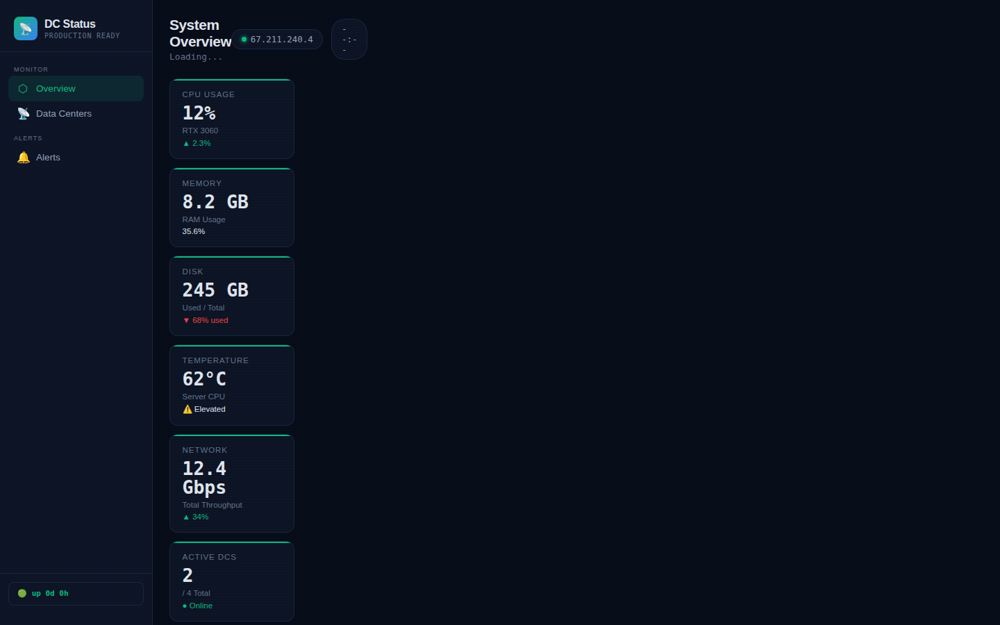
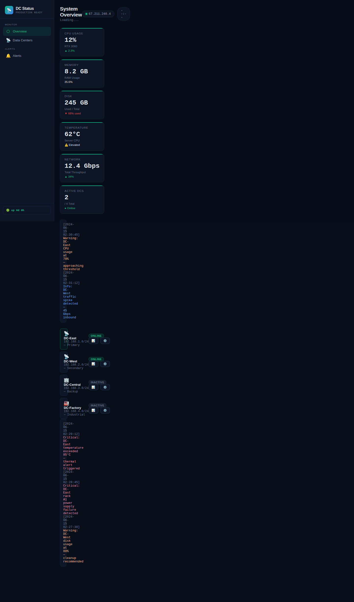

<div align="center">


# DirWatch

**A lightweight, self-hosted dashboard for monitoring Active Directory domain controller health — replication, SYSVOL, LDAP bind, and service status at a glance.**

<a href="https://github.com/OneByJorah/DirWatch/stargazers"></a>
<a href="https://github.com/OneByJorah/DirWatch/commits"></a>


</div>


## What This Is

DirWatch surfaces the health of your Active Directory domain controllers in a single dark-theme dashboard. A PowerShell collector emits a normalized JSON status file (replication state, SYSVOL, LDAP bind, DHCP scope, and service status) and the Flask app renders it as status cards, DC detail, alerts, and trends.

It is aimed at Windows admins who want a quick, dependency-light DC health view without standing up SCOM or a full monitoring stack.

## Quick Start

```bash
git clone https://github.com/OneByJorah/DirWatch.git
cd DirWatch
pip install -r requirements.txt
python3 app.py
```

Open **http://localhost:5000**. Or run it in Docker:

```bash
docker compose up -d
```

> [!NOTE]
> The app reads `mock_dc_status.json` at startup. Swap in your own collector output by mounting a real file at the same path. The included `collectors/mock_dc_collector.ps1` generates sample data.

## Features

- **Domain controller overview** — per-DC status cards with health, replication, SYSVOL, and LDAP bind state.
- **Replication monitoring** — track replication health between controllers.
- **Service status** — DNS, DHCP, and ADWS service state per DC.
- **Alerts** — severity-coded alert feed (critical / warning / info) in the dashboard.
- **Public status endpoint** — `/public` returns a simple "all systems operational" health string.
- **Dark NOC UI** — responsive sidebar layout with stats grid and DC detail pages.
- **Collector scripts** — PowerShell collectors for DC status, with Teams/Telegram notification placeholders.
- **Docker & gunicorn** — production image runs gunicorn as a non-root user.

## Architecture

```
PowerShell collector ──▶ mock_dc_status.json ──▶ Flask app (:5000) ──▶ Browser
                                                     │
                                                     ├──▶ Dashboard (/)
                                                     └──▶ Public status (/public)
```

The app loads the JSON status file once at startup and renders it through Jinja2 templates. DC data can be refreshed by regenerating the file with a collector.

## Configuration

Basic operation needs no environment variables — the app reads `mock_dc_status.json` from its working directory. The Compose/entrypoint flow accepts:

| Variable | Default | Description |
|----------|---------|-------------|
| `FLASK_ENV` | `production` | Flask environment |
| `MOCK_MODE` | `true` | Use mock DC data (no live AD required) |
| `PORT` | `5000` | App port used by the entrypoint |
| `AD_DOMAIN` | — | AD domain (live mode) |
| `AD_SERVER` | — | DC hostname (live mode) |
| `AD_USERNAME` / `AD_PASSWORD` | — | AD bind credentials (live mode) |
| `LOG_LEVEL` | `INFO` | Log verbosity |

## API / Routes

| Endpoint | Method | Description |
|----------|--------|-------------|
| `/` | GET | DC status dashboard |
| `/public` | GET | Public "all systems operational" status string |

## Dashboard Panels

| Panel | Description |
|-------|-------------|
| **DC Overview** | Status of all domain controllers |
| **Replication** | Inter-DC replication health |
| **Services** | DNS / DHCP / ADWS service state |
| **Alerts** | Recent severity-coded alerts |

## Use Cases

1. **Windows admins** — a fast DC health check without SCOM.
2. **Homelab AD labs** — monitor test domain controllers.
3. **Pre-maintenance checks** — confirm replication and services before a change window.

## Tech Stack

Python 3.11, Flask 3, Jinja2, PowerShell 5.1 collectors, gunicorn, Docker Compose.

## Screenshots

| Dashboard | Full view |
|---|---|
|  |  |

A short `docs/assets/demo.gif` walkthrough is also included.

## Contributing

Contributions are welcome — see [CONTRIBUTING.md](CONTRIBUTING.md). [Open an issue](https://github.com/OneByJorah/DirWatch/issues) to report a bug or request a feature.

## License

MIT — see [LICENSE](LICENSE).

## Connect

- [jorahone.com](https://jorahone.com)
- [GitHub Org](https://github.com/OneByJorah)
- [info@jorahone.com](mailto:info@jorahone.com)
